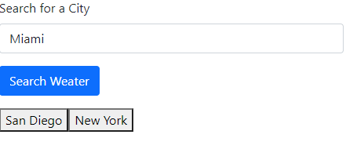

# Weather-Dashboard

## Description
I built this project to better understand how to access APIs, and to learn how to build an application around the information API contains. I learned a lot about the potential APIs have when used correctly. Some APIs are not very useful, but the OpenWeather API I used in building this project is fortunately very useful. Being able to look up the current and future weather for any city is a very powerful tool.

Link to deployed application: https://gjguerin96.github.io/Weather-Dashboard/

## Usage
The user enters what city they want to find information about in the text box in the upper left corner of the screen, and then presses the search button to bring up the information. Once they have searched a city, that city will appear as a button under the search button so users can easily look up the cities they are interested in again (see screenshot). Those previously searched cities are saved to the local storage and will persist if the page is reloaded.

## Credits
I recieved assistance from my instructor, William Vasquez. I accessed weather data with the OpenWeather API.

## License
Copyright (c) 2021 Gabriel Guerin

Permission is hereby granted, free of charge, to any person obtaining a copy of this software and associated documentation files (the "Software"), to deal in the Software without restriction, including without limitation the rights to use, copy, modify, merge, publish, distribute, sublicense, and/or sell copies of the Software, and to permit persons to whom the Software is furnished to do so, subject to the following conditions:

The above copyright notice and this permission notice shall be included in all copies or substantial portions of the Software.

THE SOFTWARE IS PROVIDED "AS IS", WITHOUT WARRANTY OF ANY KIND, EXPRESS OR IMPLIED, INCLUDING BUT NOT LIMITED TO THE WARRANTIES OF MERCHANTABILITY, FITNESS FOR A PARTICULAR PURPOSE AND NONINFRINGEMENT. IN NO EVENT SHALL THE AUTHORS OR COPYRIGHT HOLDERS BE LIABLE FOR ANY CLAIM, DAMAGES OR OTHER LIABILITY, WHETHER IN AN ACTION OF CONTRACT, TORT OR OTHERWISE, ARISING FROM, OUT OF OR IN CONNECTION WITH THE SOFTWARE OR THE USE OR OTHER DEALINGS IN THE SOFTWARE.
